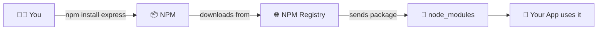
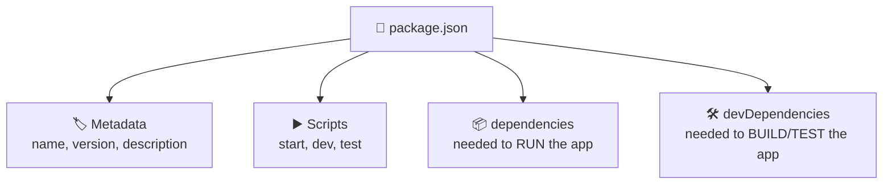
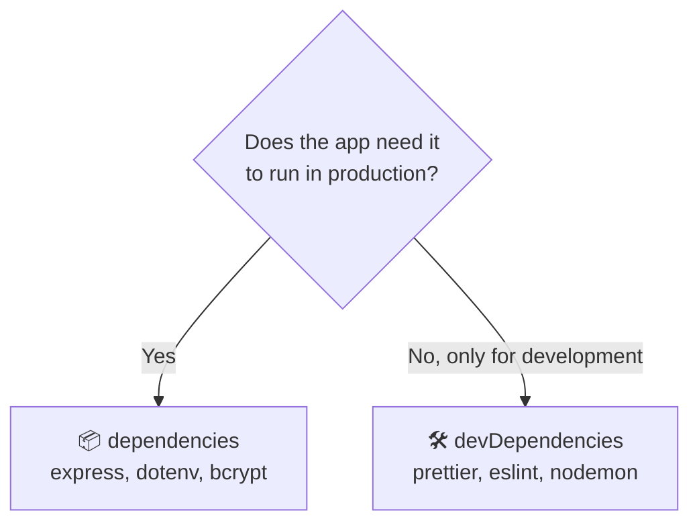
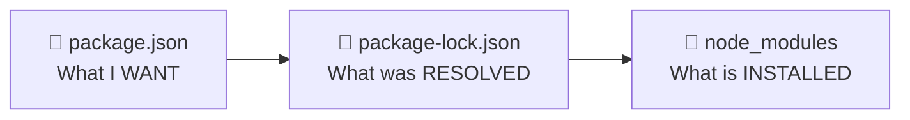
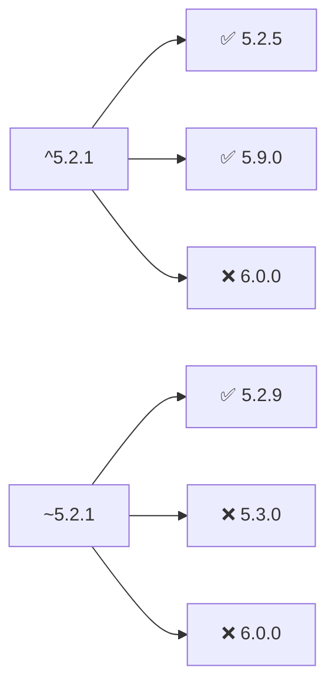
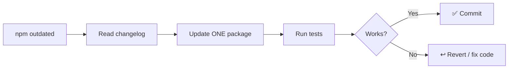
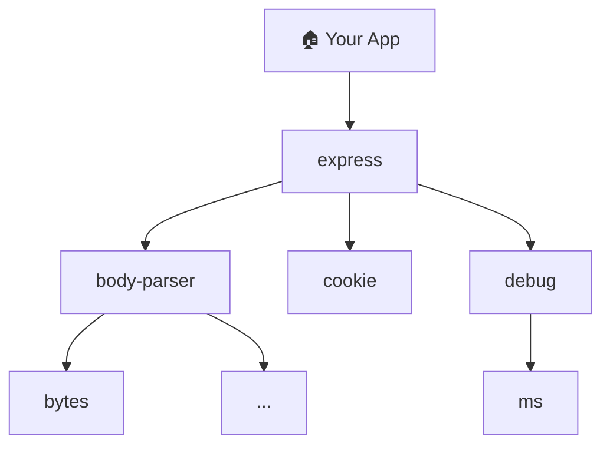
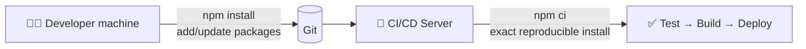
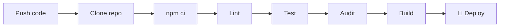

<div align="center">

# 📦 Day 7 — NPM & Package Management

### *From "I typed npm install" to "I actually understand my project"*


**Node.js & Express.js Learning Series**

</div>

---

## 🗺️ How to Use This Material

This is **not** just a document to read. It is a **workbook**. Follow this loop for every section:

```text
📖 Read  →  🧪 Try it yourself  →  ✅ Check your answer  →  🏆 Move on
```

| Icon | Meaning |
|---|---|
| 💡 | Important idea, remember this |
| 🧪 | Hands-on lab, type the commands yourself |
| 🎯 | Task, do it without copy-pasting |
| 🤔 | Think question, answer before opening the hint |
| ⚠️ | Common mistake, read carefully |
| 🏆 | Challenge, for when you feel confident |

> 💡 **Golden rule:** Don't copy-paste commands. Typing them builds muscle memory. When something breaks, that is where the real learning happens.

---

## 📑 Table of Contents

1. [What You Will Learn](#-1-what-you-will-learn)
2. [Before You Start (Setup Check)](#-2-before-you-start-setup-check)
3. [What is NPM?](#-3-what-is-npm)
4. [Packages & the Registry](#-4-packages--the-registry)
5. [Lab 1 — Create Your First Project](#-5-lab-1--create-your-first-project)
6. [Understanding package.json](#-6-understanding-packagejson)
7. [Lab 2 — Install Your First Package](#-7-lab-2--install-your-first-package)
8. [node_modules & .gitignore](#-8-node_modules--gitignore)
9. [dependencies vs devDependencies](#-9-dependencies-vs-devdependencies)
10. [package-lock.json](#-10-package-lockjson)
11. [Lab 3 — The Lockfile Experiment](#-11-lab-3--the-lockfile-experiment)
12. [Semantic Versioning (SemVer)](#-12-semantic-versioning-semver)
13. [Lab 4 — Version Ranges in Action](#-13-lab-4--version-ranges-in-action)
14. [Updating, Outdated & Uninstalling](#-14-updating-outdated--uninstalling)
15. [Direct vs Transitive Dependencies](#-15-direct-vs-transitive-dependencies)
16. [NPM Scripts](#-16-npm-scripts)
17. [npx](#-17-npx)
18. [Local vs Global Packages](#-18-local-vs-global-packages)
19. [npm install vs npm ci](#-19-npm-install-vs-npm-ci)
20. [Security & npm audit](#-20-security--npm-audit)
21. [Choosing Packages Wisely](#-21-choosing-packages-wisely)
22. [Production, Docker & CI/CD](#-22-production-docker--cicd)
23. [Workspaces & Publishing (Intro)](#-23-workspaces--publishing-intro)
24. [Debugging Challenges](#-24-debugging-challenges)
25. [Quiz Time](#-25-quiz-time)
26. [Mini Project](#-26-mini-project--day-7-capstone)
27. [Interview Questions](#-27-interview-questions)
28. [Cheat Sheet](#-28-cheat-sheet)
29. [Glossary](#-29-glossary)
30. [Progress Tracker](#-30-progress-tracker)
31. [Day 8 Preview](#-31-day-8-preview)

---

## 🎯 1. What You Will Learn

By the end of today you will be able to:

- ✅ Explain what NPM is, in your own words
- ✅ Create a Node.js project from scratch
- ✅ Read and edit `package.json` confidently
- ✅ Explain why `package-lock.json` exists
- ✅ Install, update and remove packages
- ✅ Separate runtime and development dependencies
- ✅ Read version numbers like `^5.2.1`
- ✅ Write your own NPM scripts
- ✅ Use `npx`, `npm ci` and `npm audit`
- ✅ Fix common NPM errors yourself

---

## 🛠️ 2. Before You Start (Setup Check)

Run these in your terminal:

```bash
node --version
npm --version
```

You should see version numbers like:

```text
v20.11.0
10.2.4
```

> 💡 Your numbers may differ. That is fine. Use **Node 18.11 or higher** (we use `node --watch` later).

### 🎯 Task 0

Create a folder called `day-7-npm-practice` on your computer. **Do all labs inside it.** Open it in VS Code.

<details>
<summary>🆘 Command not found?</summary>

Node.js is not installed correctly. Download the **LTS** version from [nodejs.org](https://nodejs.org), install it, then **close and reopen** your terminal.

</details>

---

## 🧠 3. What is NPM?

**NPM = Node Package Manager.**

### 🍕 Real-life analogy

Imagine you want to cook biryani. You have two options:

| Option A | Option B |
|---|---|
| Grow rice, make spices, build a stove yourself | Go to a supermarket and buy ready ingredients |

NPM is the **supermarket for code**. Someone already wrote the code for common problems. You just download it.



### NPM does 3 big jobs

| Job | Example |
|---|---|
| 📥 **Install** packages | `npm install express` |
| 📋 **Manage** versions & dependencies | `package.json`, `package-lock.json` |
| ▶️ **Run** project commands | `npm run dev` |

> 💡 NPM comes **automatically** with Node.js. No separate install is needed.

---

## 🌐 4. Packages & the Registry

A **package** is reusable code written by someone else, packed so you can install it.

| Package | What it does |
|---|---|
| `express` | Build web servers & APIs |
| `dotenv` | Load secret settings from a `.env` file |
| `jsonwebtoken` | Create login tokens (JWT) |
| `bcrypt` | Safely hash passwords |
| `cors` | Allow other websites to call your API |
| `zod` | Validate data |
| `prettier` | Auto-format your code |

The **NPM Registry** is the giant online storehouse where all of these live. Browse it at [npmjs.com](https://www.npmjs.com).

### 🤔 Think

*Without the `bcrypt` package, what would you have to do to hash passwords?*

<details>
<summary>💡 Hint</summary>

You would have to write a secure hashing algorithm yourself. That is very hard and very risky. Using a trusted package is safer and faster.

</details>

### 🎯 Task 1

Go to [npmjs.com](https://www.npmjs.com) and search for `express`. Find and write down:

1. Latest version number
2. Weekly downloads
3. License
4. Number of dependencies

---

## 🧪 5. Lab 1 — Create Your First Project

Inside `day-7-npm-practice`:

```bash
mkdir my-first-project
cd my-first-project
npm init -y
```

Now check your folder:

```bash
ls
```

You should see:

```text
package.json
```

Open it. You will see something like:

```json
{
  "name": "my-first-project",
  "version": "1.0.0",
  "description": "",
  "main": "index.js",
  "scripts": {
    "test": "echo \"Error: no test specified\" && exit 1"
  },
  "keywords": [],
  "author": "",
  "license": "ISC"
}
```

### 🤔 Think

*What does the `-y` flag do?*

<details>
<summary>💡 Answer</summary>

`-y` means "yes to everything". NPM skips all questions and uses default values. Without it, `npm init` asks you questions one by one.

</details>

### 🎯 Task 2

Run `npm init` (**without** `-y`) in a new folder. Answer each question yourself. Compare the result with the `-y` version.

---

## 📄 6. Understanding package.json

> 💡 **`package.json` is the ID card of your project.** It says who it is, what it needs, and what commands it can run.



### Important fields

| Field | Meaning | Example |
|---|---|---|
| `name` | Project name (lowercase, no spaces) | `"backend-api"` |
| `version` | Project version | `"1.0.0"` |
| `description` | What the project does | `"REST API"` |
| `main` | Entry file of the package | `"src/server.js"` |
| `type` | `"module"` for ES Modules, otherwise CommonJS | `"module"` |
| `scripts` | Custom commands | `{ "start": "node index.js" }` |
| `dependencies` | Runtime packages | `{ "express": "^5.0.0" }` |
| `devDependencies` | Development-only packages | `{ "prettier": "^3.0.0" }` |
| `private` | Prevents accidental publishing | `true` |

### CommonJS vs ES Modules (quick reminder from Day 2)

```js
// CommonJS (default)
const express = require("express");

// ES Modules (needs "type": "module")
import express from "express";
```

### 🎯 Task 3

Edit your `package.json`:

1. Change `description` to something meaningful
2. Add `"private": true`
3. Add `"type": "module"`
4. Put your name in `author`

---

## 🧪 7. Lab 2 — Install Your First Package

```bash
npm install express
```

(or the short form `npm i express`)

### What just happened? Check 4 things:

| # | What to check | What you should see |
|---|---|---|
| 1 | `package.json` | A new `"dependencies"` section with express |
| 2 | `package-lock.json` | A new, big file appeared |
| 3 | `node_modules/` | A new folder with many packages |
| 4 | Terminal output | "added XX packages" |

> 🤯 You installed **one** package, but you probably got **dozens** in `node_modules`. Why? You will learn this in [Section 15](#-15-direct-vs-transitive-dependencies).

### Create a server using Express

Create `index.js`:

```js
import express from "express";

const app = express();

app.get("/", (req, res) => {
  res.json({ success: true, message: "My first NPM project is running!" });
});

app.listen(3000, () => {
  console.log("Server running at http://localhost:3000");
});
```

Run it:

```bash
node index.js
```

Open [http://localhost:3000](http://localhost:3000) in your browser. 🎉

<details>
<summary>⚠️ Getting "Cannot use import statement outside a module"?</summary>

You forgot `"type": "module"` in `package.json`. Add it (see Task 3), or switch to `const express = require("express");`.

</details>

<details>
<summary>⚠️ Getting "address already in use :::3000"?</summary>

Another program is using port 3000. Stop the other process, or change the port number in `app.listen(...)`.

</details>

### 🎯 Task 4

Add a second route `GET /about` that returns your name and today's topic as JSON. Restart the server and test it.

---

## 📁 8. node_modules & .gitignore

`node_modules/` is the folder where NPM puts all the downloaded packages.

```text
my-first-project/
├── node_modules/        ← downloaded packages (HUGE)
├── index.js
├── package.json
└── package-lock.json
```

### 🤔 Think

*Should we upload `node_modules` to GitHub?*

<details>
<summary>💡 Answer</summary>

**No.** Reasons:

- It can contain thousands of files and hundreds of MB
- It can be recreated anytime using `package.json` + `package-lock.json`
- Some packages are built differently for different operating systems

</details>

### Create `.gitignore`

In your project root, create a file named `.gitignore`:

```text
node_modules/
.env
coverage/
dist/
logs/
```

| Line | Why ignore it |
|---|---|
| `node_modules/` | Too big, reproducible |
| `.env` | Contains **secrets** (passwords, API keys) |
| `coverage/` | Generated test reports |
| `dist/` | Generated build output |
| `logs/` | Runtime log files |

### ✅ What to commit vs not commit

| ✅ Commit | ❌ Do NOT commit |
|---|---|
| `package.json` | `node_modules/` |
| `package-lock.json` | `.env` |
| Your source code | Passwords / API keys |

### 🎯 Task 5

Run `git init`, then `git status`. Check that `node_modules` does **not** appear in the list of files. If it does, your `.gitignore` has a mistake.

---

## ⚖️ 9. dependencies vs devDependencies

Ask one question:

> **"Does my app need this package to RUN in production?"**



### Install commands

```bash
# Goes to "dependencies"
npm install express

# Goes to "devDependencies"
npm install --save-dev prettier
# short form:
npm install -D prettier
```

### Comparison

| | `dependencies` | `devDependencies` |
|---|---|---|
| Needed when app runs | ✅ Yes | ❌ No |
| Installed in production | ✅ Yes | Usually skipped |
| Examples | express, bcrypt, jsonwebtoken | prettier, eslint, test tools |

### 🎯 Task 6 — Sort them out!

For each package, decide: `dependencies` or `devDependencies`?

| Package | Your answer |
|---|---|
| `express` | ? |
| `prettier` | ? |
| `jsonwebtoken` | ? |
| `eslint` | ? |
| `bcrypt` | ? |
| `nodemon` | ? |

<details>
<summary>✅ Answers</summary>

| Package | Answer |
|---|---|
| `express` | dependencies |
| `prettier` | devDependencies |
| `jsonwebtoken` | dependencies |
| `eslint` | devDependencies |
| `bcrypt` | dependencies |
| `nodemon` | devDependencies |

</details>

### 🧪 Lab

```bash
npm install -D prettier
```

Open `package.json`. You should now see **both** sections:

```json
{
  "dependencies": {
    "express": "^5.0.0"
  },
  "devDependencies": {
    "prettier": "^3.0.0"
  }
}
```

> Your exact version numbers will be different. That's normal.

---

## 🔐 10. package-lock.json

### 🍱 Analogy

| File | Like... |
|---|---|
| `package.json` | A **shopping list**: "I need rice, around 1 kg" |
| `package-lock.json` | The **actual bill**: "Brand X rice, 1.02 kg, bought on 5 March" |



### Why does it matter?

Imagine this timeline:

```text
January  → Ravi installs the project  → gets express 5.0.0
June     → Priya installs the project → express 5.0.9 now exists
```

Without a lockfile, Ravi and Priya could end up with **different versions**. Then: *"It works on my machine!"* 😩

With a lockfile, **both get the exact same versions**.

### ✅ Rules

1. **Commit** `package-lock.json` to Git
2. **Never edit** it by hand
3. **Never delete** it casually

---

## 🧪 11. Lab 3 — The Lockfile Experiment

This lab shows the power of `npm ci`.

**Step 1:** Delete the `node_modules` folder manually (or run `rm -rf node_modules`).

**Step 2:** Try to run your app:

```bash
node index.js
```

💥 You will get an error: `Cannot find package 'express'`.

**Step 3:** Restore everything:

```bash
npm ci
```

**Step 4:** Run the app again. It works. ✅

### 🤔 Think

*How did NPM know exactly what to install?*

<details>
<summary>💡 Answer</summary>

It read `package-lock.json`, which stores the exact versions of every package, including the hidden ones, along with integrity hashes.

</details>

### 🎯 Task 7 — Break it on purpose

1. Delete `node_modules`
2. Delete `package-lock.json`
3. Run `npm install`
4. Notice: a new `package-lock.json` is generated

Now answer: *why is it better to keep the lockfile instead of regenerating it?*

---

## 🔢 12. Semantic Versioning (SemVer)

Every package version looks like this:

```text
        5  .  2  .  3
        │     │     │
      MAJOR MINOR PATCH
```

| Part | Changes when... | Safe to upgrade? | Example |
|---|---|---|---|
| **MAJOR** | Breaking changes | ⚠️ Careful, code may break | `4.0.0 → 5.0.0` |
| **MINOR** | New features, still compatible | ✅ Usually safe | `5.1.0 → 5.2.0` |
| **PATCH** | Bug fixes | ✅ Usually safe | `5.2.2 → 5.2.3` |

### 🏠 Analogy: a house

| Type | House example |
|---|---|
| PATCH | Fix a leaking tap |
| MINOR | Add a new balcony (old rooms unchanged) |
| MAJOR | Rebuild the whole floor plan. Your furniture may not fit anymore! |

### Version range symbols

| Symbol | Example | Allows | Meaning |
|---|---|---|---|
| `^` (caret) | `^5.2.1` | `5.2.1` to `5.x.x` | Same MAJOR, newer MINOR/PATCH OK |
| `~` (tilde) | `~5.2.1` | `5.2.1` to `5.2.x` | Same MINOR, only PATCH updates |
| *(none)* | `5.2.1` | `5.2.1` only | Exact version |
| `*` | `*` | Anything | ⚠️ Dangerous, avoid |



### 🎯 Task 8 — Will it be allowed?

| Range | Version | Allowed? (Yes/No) |
|---|---|---|
| `^4.18.0` | `4.19.2` | ? |
| `^4.18.0` | `5.0.0` | ? |
| `~4.18.0` | `4.18.9` | ? |
| `~4.18.0` | `4.19.0` | ? |
| `4.18.0` | `4.18.1` | ? |
| `^1.0.0` | `1.99.99` | ? |

<details>
<summary>✅ Answers</summary>

| Range | Version | Allowed? |
|---|---|---|
| `^4.18.0` | `4.19.2` | ✅ Yes |
| `^4.18.0` | `5.0.0` | ❌ No |
| `~4.18.0` | `4.18.9` | ✅ Yes |
| `~4.18.0` | `4.19.0` | ❌ No |
| `4.18.0` | `4.18.1` | ❌ No (exact) |
| `^1.0.0` | `1.99.99` | ✅ Yes |

</details>

> 💡 **Bonus fact:** For versions starting with `0` (like `^0.2.3`), caret is stricter. It allows only `0.2.x`, because `0.x` packages are considered unstable.

---

## 🧪 13. Lab 4 — Version Ranges in Action

Install a specific older version of a package:

```bash
npm install lodash@4.17.20
```

Check `package.json`: you'll see `"lodash": "^4.17.20"`.

Now see what NPM thinks:

```bash
npm outdated
```

You may see something like:

```text
Package  Current  Wanted   Latest
lodash   4.17.20  4.17.xx  4.17.xx
```

| Column | Meaning |
|---|---|
| **Current** | What is installed right now |
| **Wanted** | Highest version your `package.json` range allows |
| **Latest** | Newest version published on the registry |

### Install exact versions without a caret

```bash
npm install lodash@4.17.20 --save-exact
```

Look at `package.json` again. The `^` is gone. 🎯

### 🎯 Task 9

1. Install `dayjs` with the exact version flag
2. Install `chalk` normally
3. Look at both entries in `package.json`
4. Explain the difference in your own words

---

## 🔄 14. Updating, Outdated & Uninstalling

### Check what is old

```bash
npm outdated
```

### Update within allowed ranges

```bash
npm update
```

### Install the latest (even a new major, careful!)

```bash
npm install express@latest
```

### Remove a package

```bash
npm uninstall lodash
# same as:
npm remove lodash
```

This removes it from `node_modules`, `package.json` **and** `package-lock.json`.

### Safe update workflow ✅



> ⚠️ **Never blindly update everything right before a deployment.**

### 🎯 Task 10

1. Run `npm outdated` in your project
2. Pick one package and read its page on npmjs.com
3. Uninstall `lodash`, `dayjs` and `chalk` (clean your project)
4. Confirm they are gone from `package.json`

---

## 🌳 15. Direct vs Transitive Dependencies

You installed **1 package** (`express`) but `node_modules` has **dozens**. Why?

> Because `express` itself **depends on other packages**, and those depend on others...



| Type | Meaning | Example |
|---|---|---|
| **Direct** | Packages **you** installed | express |
| **Transitive** | Packages your packages need | debug, ms, cookie... |

### Explore your tree 🌲

```bash
npm ls --depth=0     # only your direct packages
npm ls               # full tree
npm ls express       # who uses express?
npm explain debug    # WHY is "debug" installed?
```

### 🎯 Task 11

1. Run `npm ls --depth=0`. How many direct dependencies do you have?
2. Run `npm ls`. How many lines of output? 
3. Run `npm explain` on any transitive package. Which package pulled it in?

> 💡 **Why this matters for security:** a vulnerability in a transitive dependency still affects **your** app.

---

## ▶️ 16. NPM Scripts

Scripts are **shortcuts for long commands**, defined in `package.json`.

```json
{
  "scripts": {
    "start": "node index.js",
    "dev": "node --watch index.js",
    "format": "prettier --write .",
    "check": "node --version"
  }
}
```

### Running scripts

```bash
npm start            # special: no "run" needed
npm test             # special: no "run" needed
npm run dev          # custom scripts need "run"
npm run format
npm run check
```

> 💡 Only `start`, `test`, `stop` and `restart` can skip the word `run`. All others need `npm run <name>`.

### What does `node --watch` do?

It **restarts your server automatically** whenever you save a file. (Available from Node 18.11+; this replaces the need for `nodemon` in simple cases.)

### Passing extra arguments

```bash
npm run test -- --watch
```

The `--` means: *"everything after this goes to the script, not to npm."*

### See all available scripts

```bash
npm run
```

### 🎯 Task 12 — Write your own scripts

Add all of these to your project and run each one:

| Script name | Should do |
|---|---|
| `start` | Run `index.js` normally |
| `dev` | Run with auto-restart |
| `format` | Format all files with Prettier |
| `format:check` | Check formatting without changing |
| `hello` | Print `Hello from NPM scripts!` using `node -e "console.log('Hello from NPM scripts!')"` |
| `deps:check` | Run `npm outdated` |
| `security:check` | Run `npm audit` |

<details>
<summary>✅ Solution</summary>

```json
{
  "scripts": {
    "start": "node index.js",
    "dev": "node --watch index.js",
    "format": "prettier --write .",
    "format:check": "prettier --check .",
    "hello": "node -e \"console.log('Hello from NPM scripts!')\"",
    "deps:check": "npm outdated",
    "security:check": "npm audit"
  }
}
```

Note: `npm outdated` exits with code 1 when something is outdated. That is normal, not an error in your script.

</details>

### ⚠️ Never put secrets in scripts

```json
// ❌ BAD: this gets committed to Git!
"deploy": "deploy --api-key=123456"

// ✅ GOOD: read secrets from environment variables
"deploy": "deploy"
```

---

## ⚡ 17. npx

`npx` **runs** a package's command. `npm` **installs/manages** packages.

| | `npm` | `npx` |
|---|---|---|
| Job | Install, remove, manage | Execute a package's command |
| Example | `npm install prettier` | `npx prettier --check .` |

### 🧪 Lab

```bash
# Runs the Prettier from your project's node_modules
npx prettier --version

# Try a tool without installing it permanently
npx cowsay "Learning NPM is fun"
```

> The second command may ask permission to download a temporary package. Type `y`. This shows how `npx` can run tools **without** a global install.

### 🎯 Task 13

Use `npx` to run Prettier on your project and format all files.

<details>
<summary>✅ Answer</summary>

```bash
npx prettier --write .
```

</details>

---

## 🌍 18. Local vs Global Packages

| | 📁 Local (default) | 🌍 Global (`-g`) |
|---|---|---|
| Command | `npm install express` | `npm install -g some-tool` |
| Installed in | Project's `node_modules` | System-wide |
| Version tracked in project | ✅ Yes | ❌ No |
| Team gets same version | ✅ Yes | ❌ No (everyone different) |
| Use for | App code and project tools | Rare general-purpose CLI tools |

> 💡 **Rule of thumb:** If your project needs it, install it **locally**. This keeps your team on the same versions.

### 🤔 Think

*Your teammate has Prettier v2 installed globally, you have v3. You both format the same file. What happens?*

<details>
<summary>💡 Answer</summary>

The formatting can differ, creating messy Git diffs and arguments. Installing Prettier **locally** in the project fixes this because everyone uses the version in `package.json`.

</details>

---

## ⚔️ 19. npm install vs npm ci

| | `npm install` | `npm ci` |
|---|---|---|
| Typical use | Daily development | CI/CD, Docker, production builds |
| Needs lockfile | No (creates one) | **Yes** (fails without it) |
| Can change `package-lock.json` | ✅ Yes | ❌ No |
| Deletes existing `node_modules` first | No | ✅ Yes (clean slate) |
| Fails if lock and package.json disagree | No | ✅ Yes (safety check!) |
| Speed | Normal | Usually faster |



### 🎯 Task 14

1. Open `package.json` and **manually** change an express version range
2. Do **not** run `npm install`
3. Run `npm ci`
4. Read the error. What is it telling you?

<details>
<summary>💡 What you'll see</summary>

`npm ci` refuses to continue because `package.json` and `package-lock.json` are out of sync. This protects your production builds from unexpected installs. Fix it by running `npm install` locally, then committing the updated lockfile.

</details>

---

## 🔐 20. Security & npm audit

Every package you install becomes **part of your app**. A weak package = a weak app.

### Check for known vulnerabilities

```bash
npm audit
```

Example report (shortened):

```text
found 0 vulnerabilities
```

or, if problems exist:

```text
3 vulnerabilities (1 moderate, 2 high)
```

### Severity levels

| Level | Meaning |
|---|---|
| 🟢 Low | Minor risk |
| 🟡 Moderate | Should fix soon |
| 🟠 High | Fix quickly |
| 🔴 Critical | Fix immediately |

### Fixing

```bash
npm audit fix            # safe, compatible updates only
npm audit fix --force    # ⚠️ may include BREAKING changes
```

> ⚠️ **Don't use `--force` blindly.** It can upgrade a package to a new major version and break your app. After any fix: **run tests, check the app, review the changes.**

### Use audit in CI

```bash
npm audit --audit-level=high
```

This only fails when **high or critical** issues are found.

### 🛡️ Security habits

- [ ] Run `npm audit` regularly
- [ ] Commit `package-lock.json`
- [ ] Remove packages you don't use
- [ ] Never commit `.env` or secrets
- [ ] Be careful with packages having very few downloads or odd names (typosquatting, e.g. `expresss` instead of `express`)

### 🎯 Task 15

1. Run `npm audit` on your project
2. Write down how many vulnerabilities were found
3. If any exist, run `npm audit` again to read the details. Which package is affected?

---

## 🧐 21. Choosing Packages Wisely

Before you type `npm install something`, run through this checklist:

```text
□ Do I really need this package?
□ Does Node.js already have a built-in way? (fs, path, http, crypto...)
□ Is it maintained? (recent releases on npmjs.com / GitHub)
□ Is it popular? (weekly downloads, GitHub stars)
□ Any known vulnerabilities?
□ Is the license OK for my project?
□ How many dependencies does it bring along?
□ Does it support my Node version?
```

### Built-in modules (no install needed!)

```js
import fs from "node:fs";         // files
import path from "node:path";     // file paths
import http from "node:http";     // web server
import crypto from "node:crypto"; // hashing, random values
import os from "node:os";         // system info
```

### 🤔 Think

*Someone installs a package just to check if a number is even. Good idea?*

<details>
<summary>💡 Answer</summary>

No. `n % 2 === 0` does that in one line. Every extra package adds maintenance, security risk and size. This is a real problem in the JavaScript world, so always ask "do I need this?" first.

</details>

### 🎯 Task 16 — Package Detective 🕵️

Pick **two** packages that do the same job (for example `axios` vs built-in `fetch`, or `moment` vs `dayjs`). Compare:

| Question | Package A | Package B |
|---|---|---|
| Weekly downloads | | |
| Last release | | |
| Dependencies count | | |
| License | | |
| Your choice and reason | | |

---

## 🏗️ 22. Production, Docker & CI/CD

### Production install

In production, you usually don't need dev tools like Prettier or ESLint:

```bash
npm ci --omit=dev
```

### Why this is good

| Benefit | Explanation |
|---|---|
| 📉 Smaller install | Fewer packages |
| ⚡ Faster builds | Less to download |
| 🛡️ Smaller attack surface | Fewer packages = fewer risks |

### Docker example

```dockerfile
FROM node:20-alpine
WORKDIR /app

# 1. Copy ONLY package files first
COPY package*.json ./

# 2. Install dependencies
RUN npm ci --omit=dev

# 3. Copy the rest of your code
COPY . .

CMD ["npm", "start"]
```

> 💡 **Why copy `package*.json` first?** Docker caches each step. If only your code changed (not dependencies), Docker reuses the cached `npm ci` step and the build is much faster.

### Typical CI/CD pipeline



### "Works on my machine but fails in CI" 🕵️ checklist

```text
1. Is package-lock.json committed?
2. Same Node.js version locally and in CI?
3. Same npm version?
4. Did you try `npm ci` locally?
5. Environment variables missing in CI?
6. Native packages (like bcrypt) failing to build?
7. Read the CI error log carefully!
```

---

## 🧩 23. Workspaces & Publishing (Intro)

> 💡 This is an **intro only**. Don't worry if it feels advanced. You'll use it later in bigger projects.

### Workspaces (monorepo)

Manage multiple packages in **one repository**:

```text
my-platform/
├── apps/
│   ├── api/
│   └── web/
├── packages/
│   └── shared/
└── package.json
```

Root `package.json`:

```json
{
  "private": true,
  "workspaces": ["apps/*", "packages/*"]
}
```

### Publishing your own package

```bash
npm login
npm pack --dry-run    # preview what will be published (ALWAYS do this first!)
npm publish
```

### ⚠️ Before publishing, check

- [ ] No `.env`, API keys or passwords included
- [ ] README and license present
- [ ] Correct version number
- [ ] `"private": true` is **removed** only if you really want to publish

> 💡 Applications (like your backend) should usually have `"private": true` to avoid accidental publishing.

---

## 🐛 24. Debugging Challenges

Real developers spend lots of time fixing errors. Try to solve each one **before** opening the answer.

### 🐞 Bug 1

```text
Error: Cannot find module 'express'
```

<details>
<summary>🔍 Likely causes & fix</summary>

- Express was never installed, or `node_modules` was deleted
- You are running the command in the wrong folder

**Fix:** Run `npm install` (or `npm ci`) in the folder that contains `package.json`.

</details>

### 🐞 Bug 2

```text
SyntaxError: Cannot use import statement outside a module
```

<details>
<summary>🔍 Likely cause & fix</summary>

You used `import` but your project is CommonJS.

**Fix:** Add `"type": "module"` to `package.json`, **or** use `require()`.

</details>

### 🐞 Bug 3

```text
npm error Missing script: "dev"
```

<details>
<summary>🔍 Likely cause & fix</summary>

There is no `dev` entry in the `scripts` section (or a typo).

**Fix:** Add it to `package.json`, then run `npm run`. This lists all valid scripts.

</details>

### 🐞 Bug 4

```text
npm error code EJSONPARSE
```

<details>
<summary>🔍 Likely cause & fix</summary>

Your `package.json` has invalid JSON, usually a **missing comma**, an **extra trailing comma**, or single quotes instead of double quotes.

**Fix:** Look at the line number in the error. JSON needs double quotes and no trailing commas.

</details>

### 🐞 Bug 5

```text
npm ci can only install packages when your package.json and package-lock.json are in sync
```

<details>
<summary>🔍 Likely cause & fix</summary>

Someone edited `package.json` without updating the lockfile.

**Fix:** Run `npm install` locally, commit **both** files, then retry `npm ci`.

</details>

### 🐞 Bug 6

```text
Error: listen EADDRINUSE: address already in use :::3000
```

<details>
<summary>🔍 Likely cause & fix</summary>

Another process is already using port 3000. Possibly a previous server you forgot to stop.

**Fix:** Stop the old process (Ctrl + C in its terminal) or use another port.

</details>

### 🐞 Bug 7

You cloned a project from GitHub and `npm start` fails. You see no `node_modules` folder.

<details>
<summary>🔍 Fix</summary>

`node_modules` is never committed. Run `npm install` (or `npm ci`) first, then `npm start`.

</details>

### 🐞 Bug 8 — Think like a detective

A teammate says: *"I installed prettier but when I run `prettier --write .` it says command not found."*

<details>
<summary>🔍 Fix</summary>

Locally installed binaries are not on the system PATH. Use `npx prettier --write .`, or add a script `"format": "prettier --write ."` and run `npm run format`. NPM scripts automatically know about local binaries.

</details>

---

## 📝 25. Quiz Time

Answer on paper first. Then open the answers.

**Q1.** What does NPM stand for?

**Q2.** Which file records exact installed versions?
- A) package.json  B) package-lock.json  C) .gitignore  D) index.js

**Q3.** Where should `eslint` go? 
- A) dependencies  B) devDependencies

**Q4.** What does `^2.4.1` allow?
- A) Only 2.4.1  B) 2.4.1 up to below 3.0.0  C) Anything  D) 2.4.x only

**Q5.** What does `~2.4.1` allow?
- A) 2.4.1 up to below 2.5.0  B) 2.4.1 up to below 3.0.0  C) Anything  D) Only 2.4.1

**Q6.** Which command is best for a clean install in CI?
- A) npm update  B) npm ci  C) npm init  D) npm prune

**Q7.** Should `node_modules` be committed? (Yes/No)

**Q8.** What does `npm audit` do?

**Q9.** What is a transitive dependency?

**Q10.** Why shouldn't you run `npm audit fix --force` blindly?

**Q11.** What is the difference between `npm` and `npx`?

**Q12.** A package goes from `3.8.2` to `4.0.0`. Is it likely safe to upgrade without checking? Why?

<details>
<summary>✅ Answers</summary>

1. **N**ode **P**ackage **M**anager
2. **B** — package-lock.json
3. **B** — devDependencies (development tool)
4. **B** — 2.4.1 up to below 3.0.0
5. **A** — 2.4.1 up to below 2.5.0
6. **B** — npm ci
7. **No**
8. It checks your dependency tree against known security vulnerabilities.
9. A package your app doesn't install directly, but that one of your dependencies needs.
10. It can upgrade packages to new major versions, causing breaking changes. Review changes and run tests instead.
11. `npm` installs and manages packages. `npx` executes package commands.
12. No. A MAJOR version bump usually means breaking changes. Read the changelog and test first.

</details>

### 🏅 Scoring

| Score | Level |
|---|---|
| 11-12 | 🏆 NPM Master |
| 8-10 | 🥈 Almost there |
| 5-7 | 🥉 Revise Sections 9-20 |
| 0-4 | 📚 Re-read and redo the labs |

---

## 🚀 26. Mini Project — Day 7 Capstone

### 📋 Goal

Build a **professionally set up Express project** using everything from today.

### Final folder structure

```text
day-7-project/
│
├── src/
│   ├── config/
│   ├── controllers/
│   ├── routes/
│   ├── services/
│   └── server.js
│
├── tests/
│
├── .env
├── .gitignore
├── package.json
├── package-lock.json
└── README.md
```

### ✅ Step-by-step checklist

#### Part A: Setup

- [ ] Create the `day-7-project` folder and run `npm init -y`
- [ ] Set `"private": true` and `"type": "module"`
- [ ] Install `express` and `dotenv`
- [ ] Install `prettier` as a dev dependency
- [ ] Create `.gitignore` (node_modules, .env, coverage, dist)
- [ ] Create `.env` with `PORT=3000`

#### Part B: Scripts

- [ ] `dev` → `node --watch src/server.js`
- [ ] `start` → `node src/server.js`
- [ ] `test` → `node --test`
- [ ] `format` → `prettier --write .`
- [ ] `format:check` → `prettier --check .`
- [ ] `deps:check` → `npm outdated`
- [ ] `security:check` → `npm audit`
- [ ] `clean:install` → `npm ci`

#### Part C: Code

Create `src/server.js`:

```js
import "dotenv/config";
import express from "express";

const app = express();
const PORT = process.env.PORT || 3000;

app.get("/", (req, res) => {
  res.json({
    success: true,
    message: "Day 7 NPM project is running"
  });
});

app.listen(PORT, () => {
  console.log(`Server running on port ${PORT}`);
});
```

- [ ] Run `npm run dev` and open `http://localhost:3000`
- [ ] Add `GET /health` returning `{ "status": "ok" }`
- [ ] Add `GET /info` returning your name, today's date and the Node version (`process.version`)

#### Part D: Dependency health

- [ ] Delete `node_modules`, run `npm run clean:install`, and confirm the app still works
- [ ] Run `npm ls --depth=0`, then screenshot it
- [ ] Run `npm run security:check`
- [ ] Run `npm run deps:check`

#### Part E: Documentation

- [ ] Write your own `README.md` in the project with: what the project is, how to install, how to run, and the list of scripts

### 🏆 Bonus Challenges

| Level | Challenge |
|---|---|
| 🥉 Easy | Add a `cors` package and use it in your server |
| 🥈 Medium | Write a first test in `tests/` using the built-in `node:test` |
| 🥇 Hard | Create a `Dockerfile` using `npm ci --omit=dev` |
| 💎 Expert | Set up a `workspaces` repo with `apps/api` and `packages/shared` |

<details>
<summary>💡 Starter test for the Medium bonus</summary>

`tests/basic.test.js`:

```js
import test from "node:test";
import assert from "node:assert";

test("math still works", () => {
  assert.strictEqual(1 + 1, 2);
});
```

Run with `npm test`.

</details>

### ✅ Self-evaluation rubric

| Criteria | Done? |
|---|---|
| Project runs with `npm run dev` | ☐ |
| Dependencies and devDependencies are correctly split | ☐ |
| `.gitignore` correct, `node_modules` not tracked | ☐ |
| `package-lock.json` exists and is committed | ☐ |
| `npm ci` works after deleting `node_modules` | ☐ |
| `npm audit` reviewed | ☐ |
| All scripts work | ☐ |
| README written | ☐ |

---

## 💼 27. Interview Questions

### 🟢 Beginner

<details>
<summary><b>1. What is NPM?</b></summary>

The default package manager for Node.js. It installs, manages, runs and publishes packages, and it is also the name of the online registry that hosts them.

</details>

<details>
<summary><b>2. What is package.json?</b></summary>

A file with project metadata, scripts and dependency declarations.

</details>

<details>
<summary><b>3. What is node_modules?</b></summary>

The folder that holds all installed packages, including their own dependencies.

</details>

<details>
<summary><b>4. dependencies vs devDependencies?</b></summary>

`dependencies` are required when the app runs. `devDependencies` are used for development, such as linting, formatting, testing and build tools.

</details>

<details>
<summary><b>5. What is package-lock.json?</b></summary>

It stores the exact resolved versions of the whole dependency tree with integrity hashes, so installs are reproducible.

</details>

### 🟡 Intermediate

<details>
<summary><b>6. npm install vs npm ci?</b></summary>

`npm install` is flexible and can update the lockfile. `npm ci` deletes `node_modules`, installs strictly from the lockfile and fails if the lockfile and `package.json` disagree. It is ideal for CI/CD.

</details>

<details>
<summary><b>7. Explain ^ and ~.</b></summary>

`^1.2.3` allows updates up to (not including) `2.0.0`. `~1.2.3` allows updates up to (not including) `1.3.0`.

</details>

<details>
<summary><b>8. What is npx?</b></summary>

A tool to run package binaries, either from local `node_modules` or by temporarily downloading them.

</details>

<details>
<summary><b>9. Why commit package-lock.json?</b></summary>

So every developer, CI server and production build installs the same dependency versions.

</details>

<details>
<summary><b>10. What is semantic versioning?</b></summary>

`MAJOR.MINOR.PATCH`. Major means breaking changes, minor means backward-compatible features, patch means bug fixes.

</details>

### 🔴 Advanced

<details>
<summary><b>11. What are transitive dependencies?</b></summary>

Dependencies of your dependencies. They are installed automatically and still affect your app's security and stability.

</details>

<details>
<summary><b>12. Why not commit node_modules?</b></summary>

It is huge, can be platform-specific, and can be fully recreated from `package.json` and the lockfile.

</details>

<details>
<summary><b>13. Should you always run npm audit fix?</b></summary>

`npm audit fix` is usually reasonable, but always review the changes and run tests. `--force` can introduce breaking changes.

</details>

<details>
<summary><b>14. How do you reduce supply-chain risk?</b></summary>

Keep dependencies minimal, commit the lockfile, audit regularly, vet new packages, avoid unmaintained or suspicious ones, and use `npm ci` in pipelines.

</details>

<details>
<summary><b>15. App works locally but fails in CI. How do you investigate?</b></summary>

Compare Node and npm versions, check that the lockfile is committed and in sync, reproduce with `npm ci` locally, check environment variables, check native dependencies, and read the CI logs.

</details>

---

## 🧾 28. Cheat Sheet

| 🎯 I want to... | 💻 Command |
|---|---|
| Start a project | `npm init -y` |
| Install all dependencies | `npm install` |
| Install a package | `npm install <pkg>` |
| Install a dev package | `npm install -D <pkg>` |
| Install a specific version | `npm install <pkg>@1.2.3` |
| Install exact (no ^) | `npm install <pkg> --save-exact` |
| Remove a package | `npm uninstall <pkg>` |
| See outdated packages | `npm outdated` |
| Update within ranges | `npm update` |
| Clean reproducible install | `npm ci` |
| Production-only install | `npm ci --omit=dev` |
| Run a script | `npm run <name>` |
| List all scripts | `npm run` |
| Start / test | `npm start` / `npm test` |
| Run a package binary | `npx <pkg>` |
| Show direct dependencies | `npm ls --depth=0` |
| Show full tree | `npm ls` |
| Why is this installed? | `npm explain <pkg>` |
| Remove extraneous packages | `npm prune` |
| Security check | `npm audit` |
| Safe security fix | `npm audit fix` |
| Preview publish contents | `npm pack --dry-run` |

---

## 📖 29. Glossary

| Term | Simple meaning |
|---|---|
| **Package** | Reusable code someone shared |
| **Registry** | Online store of packages |
| **Dependency** | A package your project needs |
| **Transitive dependency** | A package your dependency needs |
| **Lockfile** | File that freezes exact versions |
| **SemVer** | Versioning rule: MAJOR.MINOR.PATCH |
| **Script** | A shortcut command in package.json |
| **Binary / CLI** | A command a package provides |
| **CI/CD** | Automatic test-and-deploy pipeline |
| **Monorepo** | Many projects in one repository |
| **Vulnerability** | A security weakness |
| **Supply-chain attack** | Hackers target packages you depend on |

---

## ✅ 30. Progress Tracker

### Knowledge

- [ ] I can explain what NPM is
- [ ] I understand `package.json`
- [ ] I understand `package-lock.json`
- [ ] I know what `node_modules` is and why I don't commit it
- [ ] I know dependencies vs devDependencies
- [ ] I can read `^` and `~`
- [ ] I understand MAJOR / MINOR / PATCH
- [ ] I know direct vs transitive dependencies
- [ ] I know `npm install` vs `npm ci`
- [ ] I can explain `npx`
- [ ] I know local vs global packages
- [ ] I can run and read `npm audit`

### Practice

- [ ] Completed Lab 1 to Lab 4
- [ ] Completed Tasks 0 to 16
- [ ] Solved all debugging challenges
- [ ] Scored 8+ on the quiz
- [ ] Finished the Mini Project

### 🎖️ Badges

| Badge | Earned when |
|---|---|
| 🥉 **Installer** | Labs 1 and 2 done |
| 🥈 **Version Hunter** | Tasks 8 and 9 done |
| 🥇 **Script Writer** | Task 12 done |
| 🛡️ **Security Guard** | Task 15 done |
| 🏆 **NPM Master** | Mini project and quiz done |

---

## 🔮 31. Day 8 Preview

### 🔐 Environment Variables & Configuration

Tomorrow you will learn:

- What environment variables are
- Why secrets must never live inside code
- `.env` files and `process.env`
- Development vs production configuration
- Validating configuration and handling missing variables
- Managing API keys and JWT secrets safely

---

## ⭐ Series Progress

```text
Day 0  → Getting Started & Roadmap             ✅
Day 1  → Node.js Runtime & Event Loop          ✅
Day 2  → CommonJS vs ES Modules                ✅
Day 3  → File System & File Handling           ✅
Day 4  → EventEmitter                          ✅
Day 5  → Streams & Buffers                     ✅
Day 6  → Callbacks, Promises & Async/Await     ✅
Day 7  → NPM & Package Management              ✅ ← You are here
Day 8  → Environment Variables & Configuration 🔜
...
Day 20 → Production-Ready Express Architecture 🔜
```

---

<div align="center">

## 🧠 Final Mental Model

```text
package.json       →  what I WANT
package-lock.json  →  what was RESOLVED
node_modules       →  what is INSTALLED
```

### *Learn → Practice → Build → Understand*

**"I know Node.js"** → **"I can manage a real Node.js project."**

⭐ **Day 7 Complete** ⭐

</div>
